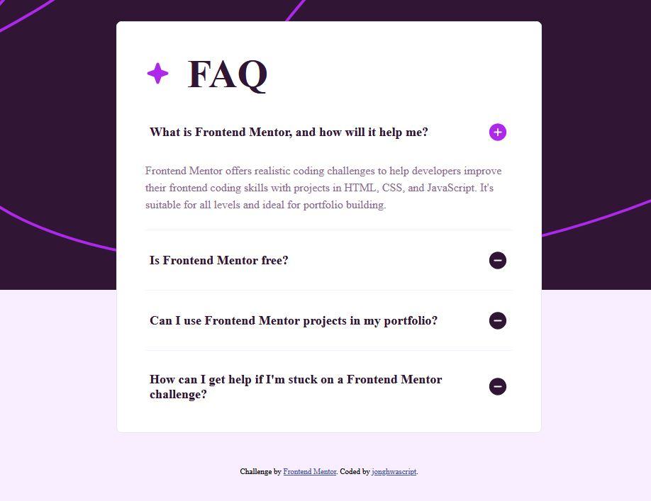

# Frontend Mentor - FAQ accordion solution

This is a solution to the [FAQ accordion challenge on Frontend Mentor](https://www.frontendmentor.io/challenges/faq-accordion-wyfFdeBwBz). The project uses HTML, CSS, and vanilla JavaScript to build an FAQ card with independently collapsible answers.

## Table of contents

- [Overview](#overview)
  - [The challenge](#the-challenge)
  - [Screenshot](#screenshot)
  - [Running locally](#running-locally)
- [My process](#my-process)
  - [Built with](#built-with)
  - [What I learned](#what-i-learned)
  - [Continued development](#continued-development)
- [Author](#author)

## Overview

### The challenge

The challenge asks users to be able to:

- Show or hide an answer by clicking its question.
- Navigate questions and toggle answers using only a keyboard.
- View a layout that adapts to different screen sizes.
- Identify interactive elements through hover and focus states.

The current implementation starts with the first answer expanded and the remaining answers collapsed. Each question can be toggled independently, so multiple answers can stay open at once.

### Screenshot



### Running locally

Download or clone the project and open `index.html` in a browser. No dependency installation or build step is required.

Use Tab and Shift+Tab to move between question buttons, then press Enter or Space to toggle an answer.

### Storybook and Chromatic

Use Node.js 22 and npm. Install the locked dependencies and start Storybook:

```sh
npm ci
npm run storybook
```

Open http://localhost:6006. `Components/Accordion` includes Default, AllClosed,
and AllOpen stories, plus an automatically generated Docs page. Autodocs is enabled
for all stories through `@storybook/addon-docs` and the global `autodocs` tag.
The initial-state control resets the rendered accordion;
clicks toggle individual answers without changing that control. The stories reuse
the markup in `index.html`, preserve its accessibility attributes, and load
`style.css` plus its fonts and images through Vite.

Build the static site with `npm run build-storybook`; output goes to the ignored
`storybook-static/` directory.

To publish from PowerShell:

```powershell
$env:CHROMATIC_PROJECT_TOKEN = "YOUR_PROJECT_TOKEN"
npm run chromatic
```

Alternatively, run `npm run chromatic -- --project-token=YOUR_PROJECT_TOKEN`.
Do not commit the token. For automatic publishing, add the repository Actions
secret `CHROMATIC_PROJECT_TOKEN`, then push the configuration and `package-lock.json`.
The Chromatic workflow runs on pushes and builds Storybook before uploading.
It exits after upload; remove `--exit-once-uploaded` to wait for visual test results.

## My process

### Built with

- Semantic HTML, including `main`, `header`, headings, and native buttons
- CSS custom properties for colors and spacing
- Flexbox and reusable layout classes
- Fluid sizing with `clamp()`
- Mobile and desktop background assets with a media query
- Vanilla JavaScript for answer toggling
- `hidden`, `aria-controls`, and `aria-expanded` for panel relationships and state
- `:focus-visible` for keyboard focus styling

### What I learned

#### Choosing elements by their purpose

The FAQ title and questions belong inside the page's main content. A `header` groups the title and decorative star, while `div` elements provide layout grouping where no additional semantic meaning is needed. Native buttons give each question keyboard focus and built-in Enter and Space activation.

#### Keeping visibility and accessibility state synchronized

Each question button identifies its answer through `aria-controls`. JavaScript uses that value to find the panel, toggles its `hidden` property, and updates `aria-expanded` to match. This keeps the state exposed to assistive technology aligned with the answer's visibility.

The current click listener is attached to the question heading. Button clicks, including those produced by keyboard activation, bubble up to that heading and run the toggle handler.

#### Separating decoration from content

The lines between questions use CSS borders instead of empty divider elements. This keeps decorative details in the stylesheet and reduces unnecessary markup.

#### Making keyboard focus visible

A transparent outline alone does not provide a visible focus indicator. The question title reserves space for a transparent border, which turns violet when its button matches `:focus-visible`. Reserving that space prevents the border from shifting the content when focus changes.

#### Building flexible layouts

The `stack`, `center`, `box`, and `cluster` classes organize the layout into reusable pieces. CSS custom properties control spacing, while `clamp()` adjusts typography, card padding, and other dimensions within defined limits.

### Continued development

- Test the accordion with screen readers and across browsers, including keyboard navigation and state announcements.
- Refine hover feedback and check that expand/collapse icons use the correct paths and match the panel state.
- Validate the stylesheet and review the font declarations and asset loading.
- Check narrow screens and browser zoom for overflow, readable text, and comfortable spacing.
- Consider attaching click listeners directly to the trigger buttons to make the interaction code clearer.

## Author

- Frontend Mentor - [@jonghwascript](https://www.frontendmentor.io/profile/jonghwascript)
